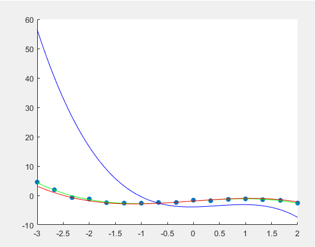
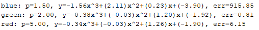
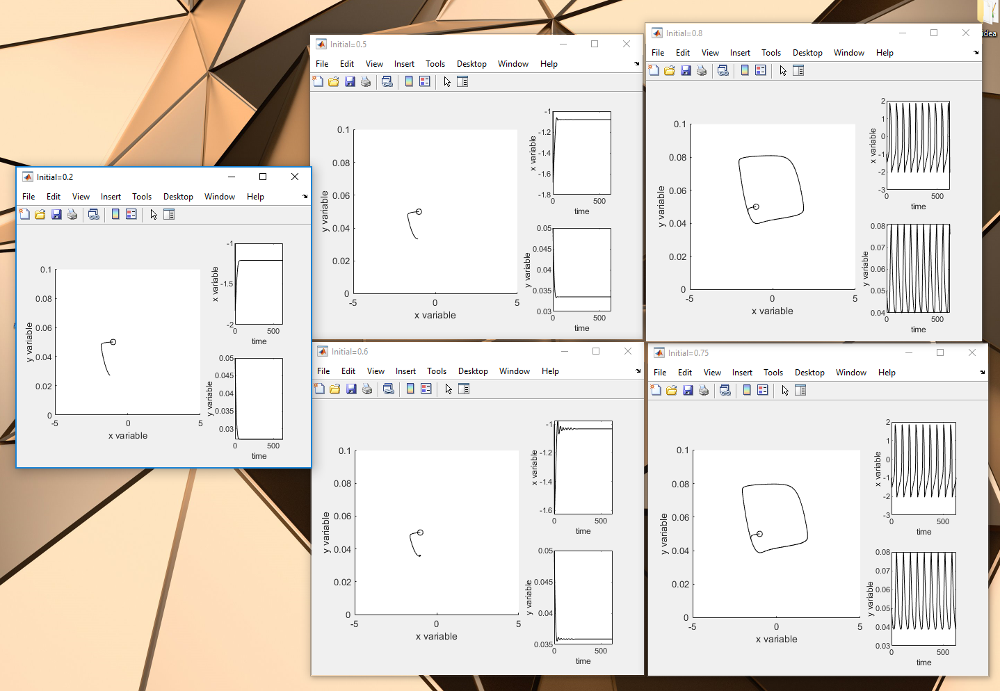

# Repository: The Numerical Library
--My Numerical Library in MATLAB

# Contents:
1, <b>PolyRegression.m</b> Application of Newton's Method to find the best-fit polynomial equation  

  

2, <b>FitzhughNagumo.m</b> Visualize the trajectory of some initial values of the FitzHugh-Nagamo Model
 <i>In the sample imput, we have 3 sinks and 2 stable orbits</i>

